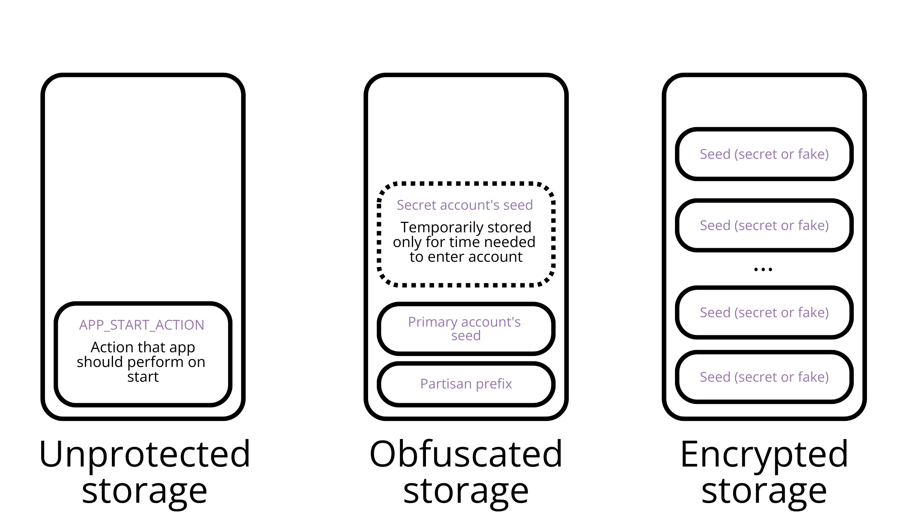
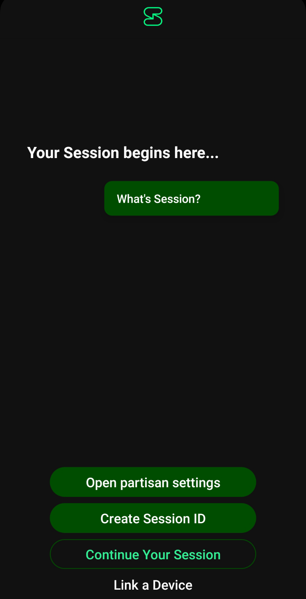
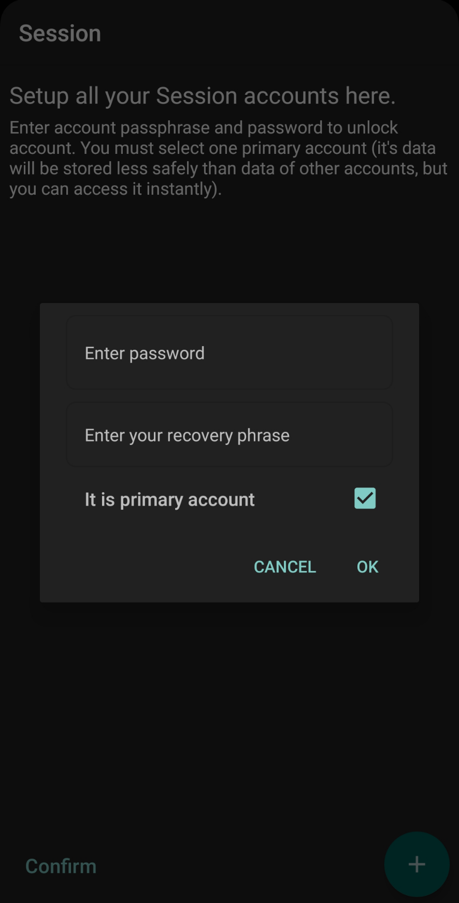
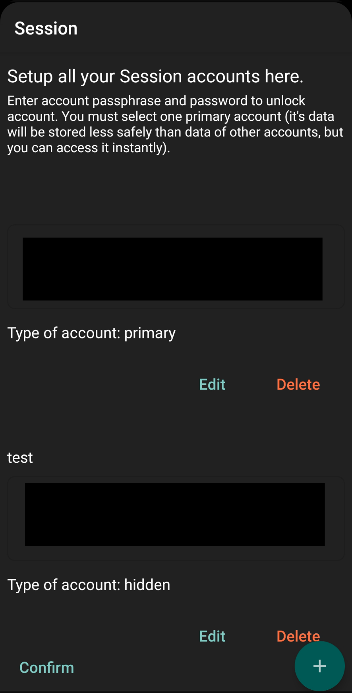
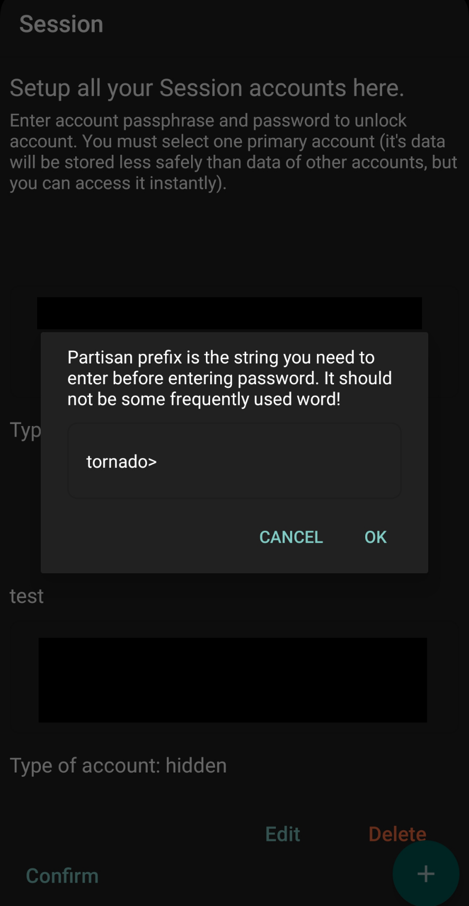
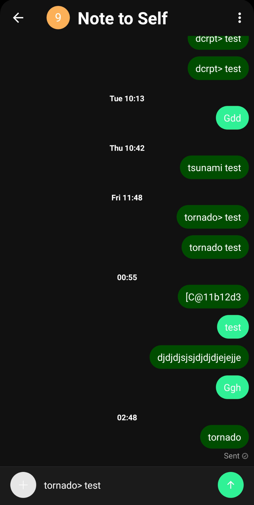
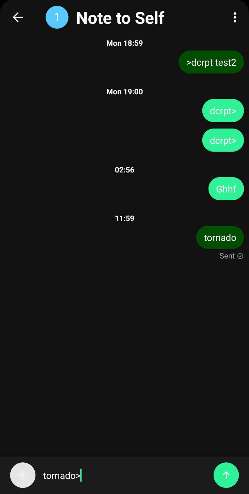

# PSession
**The application is under development, I would like to hear more opinions about the application before recommending it for use in situations where your safety depends on its security.**

**Important: Although I am a crypto enthusiast, I do my best to make PSession as secure as possible, and try to avoid rolling out my crypto as much as possible, I am not an expert in this field and can make mistakes. If you are a cryptography professional, then your opinion, your advice, or your help is vital to the project.**
## Problem
At the moment, in my opinion, Session is one of the best messengers for confidential and anonymous communication. Nevertheless, although it protects users well from government surveillance and leakage of their data, many users [emphasized](https://github.com/oxen-io/session-android/issues/1305), that it does not provide protection for correspondence in case the device falls into the hands of an adversary who is able to put pressure on the user of the device and force him to unlock the messenger. This threat is a sad reality for billions of people living in authoritarian and totalitarian regimes or under strict control from third parties (in dysfunctional families, under occupation, in sects, etc.).
Although protecting messages from a powerful adversary capable of threatening the user and having control over the device is an extremely difficult task, [encryption with plausible deniability](https://en.wikipedia.org/wiki/Deniable_encryption) can be used to solve it. There is already a custom client for Telegram "[Partisan Telegram](https://github.com/wrwrabbit/Partisan-Telegram-Android/releases)", which allows you to create fake login codes, when entering which hidden information (accounts or messages) is deleted, and the adversary sees only the information that the user is ready to show him. However, telegram by its design is an extremely insecure messenger that stores messages on a centralized server, requires a phone number to register, does not use end-to-end encryption by default, and is vulnerable to [metadata analysis](https://www.nytimes.com/2023/07/03/technology/russia-ukraine-surveillance-tech.html ) and [monitoring](https://www.wired.com/story/the-kremlin-has-entered-the-chat/) from the side of the special services.
## Suggested solution 
I suggest creating a system for Session that allows you to store encrypted data from multiple accounts in one application and plausibly deny the existence of at least some of them - this is PSession. Session currently uses either a fingerprint on the lock screen, which I can't do anything with, or, if the user does not use a fingerprint to lock the phone, an Android system component (Intent(ACTION_CONFIRM_DEVICE_CREDENTIAL)) that repeats the settings of the Android lock screen. Therefore, in this modification, the password must be entered not at the entrance to the application, but in the field for sending messages (for now), and in addition to the password, you will need to enter the prefix specified by the user.
## Threat models, tasks and solutions
### Weak adversary
**Features:**
* He is capable of analyzing only the graphical interface of the application
* His time resources are limited
* He can threaten the user and force him to perform the actions he needs with the application.

**Task**
* After completing the settings, the application should be indistinguishable from a regular Session, no matter what actions are performed with its graphical interface. Thus, it will be possible to avoid unnecessary attention and examination from a more powerful opponent.

**Solutions**
* After configuring the application, the button for opening special settings is deleted.
* In order to perform any actions with the application that are not provided for in the original Session, you will need to enter a user-defined prefix.
* Otherwise, the application does not change the Session interface and does not create additional bugs in it.
### Powerful adversary
**Features:**
* He has full control over the device (root access) and serious technical knowledge and capabilities.
* He has many time and large material resources
* He can threaten the user and force him to perform the actions he needs with the application or provide any information that he wants to receive.

**Task**
* **It is technically impossible to hide the fact that a modified Session is installed on the device!**
* The user must be able to configure the application in such a way as to leave at least one Session account or at least some of the messages undisclosed.

**Solutions**
* The application stores secret phrases from different user accounts. The [Armadillo](https://github.com/patrickfav/armadillo/tree/main) library is used for encryption in the application. It is written in Java and its code is clear to me, its author has been engaged in cryptography for a long time, data obfuscation is carried out in it, it provides extensive configuration options. AES GCM is used under the hood. bcrypt is used as the default key generation function, but I replaced it with Argon2id ([wrapper from Signal](https://github.com/signalapp/Argon2)) to follow [OWASP guidelines](https://cheatsheetseries.owasp.org/cheatsheets/Password_Storage_Cheat_Sheet.html).
* To enter secret data, the keyboard switches to incognito mode.
* The application has three types of storage based on SharedPreferences: unsecured, obfuscated and encrypted. Unsecured storage stores data that is useless to an attacker. In the obfuscated storage, encrypted without using a user password, slightly more sensitive data is constantly stored, which the user is ready to disclose to a powerful opponent and whose existence cannot be hidden from him (therefore, he can still force them to give out under pressure), or secret data is stored there for a short time. With full access to the device and a strong desire, this data can be obtained, but this will not create additional problems for the user. The encrypted storage contains secret data securely encrypted with its password.
* The user chooses one main account, which he is ready to show to the attacker and to which he can quickly switch without a password, the rest of the accounts are considered secret. The passphrase of the main account is entered into the obfuscated storage and can be obtained without a password. The user prefix is also stored in the obfuscated storage. 10 (currently) encrypted vaults are being created. Randomly selected storages in which encrypted passphrases from secret user accounts will be stored. Encrypted fake data will be saved to the other storages. Fake secret phrases are generated using the built-in Session function. The fake data is encrypted using a randomly generated key. The program itself does not remember where the real data is and where the fake data is. When entering a password, the application tries to decrypt each protected storage and, if some passphrase was successfully decrypted, it is temporarily copied into the obfuscated storage, used to log into the application and deleted from the storage. This is done in order to make the number of hidden accounts uncertain and make the adversary's goal less clear to himself, which may allow the user to reveal only part of his hidden accounts under pressure, plausibly denying the existence of the rest.
* The data storage scheme in the application is shown below:
  

## Usage manual
1. It's recommended to uninstall original Session
2. You can download app from [releases](https://github.com/dissidents0ft/partisan-session-android/releases).
3. You can work with Session as usual, but it's recommended to configure PSession as soon as possible. There would be button to enter partisan settings on the start screen.

 

4. You can add a new account by entering its passphrase and password to unlock the account. The number of accounts at the moment should not be more than 10. The password must be strong, but memorable, at the moment it is not checked by the application. You should mark one of the accounts as the main one (by the way, a password is not required for it). This is an account that you are ready to show to the adversary. It shouldn't be empty!
   

5. You can edit or remove entries in list.
   

6. Make sure that everything is entered correctly - at this stage of the development of the application, you will never be able to edit these settings again! Click the "Confirm" button. Enter your prefix. The table in which account and password data was temporarily stored will be deleted (perhaps after that the application should erase RAM, but this has not yet been implemented). After that, fake records will be generated and all records will be encrypted.
   

7. You'll automatically enter your main account
8. Exit the app and kill it. This is necessary because of some still unclear bug.
9. Log in again. Open any dialog (preferably a dialog with yourself) and enter the line "your_prefix your_password" in the message input field. Send a message. Of course, it will not go anywhere, but will be processed, and the application will try to decrypt all records in encrypted storages. If decryption was successful, then all data from the current account is deleted, the cache is cleared, the application is restarted, and the decrypted passphrase is used to automatically log into your secret account.
   

10. You can log into any other hidden account by repeating steps 8-9, or quickly log into the main account by simply entering a prefix without a password in the message input field.

 

## Upcoming work
### Changes to be made in the near future
At the moment, only a quick and dirty implementation of the basic functionality is ready. There are still a lot of things to work on:
* I will move the input field to the search field to reduce the risk of accidentally sending a message with your prefix and password
* The ability to specify custom memory limits for the Argon2 key generation algorithm will be added. Thus, in order to obtain the correct key, you will need to know not only the password, but also the memory limits used when generating key. This will be similar to using PIM in Veracrypt.
* The ability to select the number of encrypted vaults will be added. You probably shouldn't raise it, but you can lower it so that the algorithm works faster.
* Disruptor accounts will be added. When you add an entry, you can mark the account as a disruptor. If, during decryption, it turns out that this record is a disruptor, then all data in encrypted vaults will be overwritten with random data.
* The ability to edit partisan settings after the initial setup will be added.
* A one-time login option will be added. If you select this option when logging into secret account, then if the application stays in the background for longer than the specified time or if it is killed, the data of the hidden account will be erased and the main account will be logged in.
* RAM erasure will be added after completing the settings or logging into the Session, as in [Molly](https://github.com/mollyim/mollyim-android).
* The GUI will be improved, input validators, hints, and dialogs will be added. The application should become more intuitive.
* The quality of the code will be improved.
* More tests will be added.
* The ability to automatically skip the notification type selection will be added.

### Changes that I will try to make someday
* Full multiaccount in the Session. At the moment, when entering a password, the user is thrown out of the current account and transferred to another, which does not look as nice and convenient as adding a new account to a multiaccount. However, maybe the developers will add it themselves.
* Ability to hide messages.
* At the moment, the Argon2 parameters are selected in such a way as to maintain a balance between security and speed on the devices I tested (they are stricter than [recommended by OWASP](https://cheatsheetseries.owasp.org/cheatsheets/Password_Storage_Cheat_Sheet.html#argon2id)). However, on devices of different capacities, you can choose different algorithm settings. I would like to make something like a system in KeepassXC that allows the user to choose for himself how long the key generation algorithm should run, and selects Argon2 parameters based on the user's choice.
* The ability to check for app updates.
### Changes that I can't make by myself
* Porting Pssession to other platforms, especially Linux.
* Translating the application into more languages.
## Key assumptions
* The application relies heavily on the reliability of encryption in the Armadillo library.
* It is assumed that records encrypted with a randomly encrypted key will not be able to be distinguished from similar format records encrypted with a key obtained through Argon2.
* It is assumed that passwords do not stay in memory longer than necessary.
  At the moment, the validity of these assumptions has not been fully studied.
## Known bugs
* For some reason, immediately after logging into a new account, you will not be able to switch to another account - before that, you need to kill the application.
## What definitely can't PSession protect against?
* From spyware that can intercept the password you enter into the application.
* From peeping or blurting out the password.
* If you get caught with the app at the moment when you are logged in to a hidden account. Adding a one-time login feature will reduce this threat.
* From self-anonymization. If Alice sends Bob a photo of her passport via Session, and Bob informs adversary about that, then it will be very difficult for Alice to plausibly deny that she has an account from which she corresponded with Bob. However, adding a message hiding feature can help Alice keep at least some of her secrets.
* In general, the more preliminary information the opponent has about you, the higher his confidence in the reliability of this information and the better the opponent understands exactly what he wants to find from you, the less likely it is that PSession will help you confuse him and not give him what he needs.
* In addition, the fewer hidden accounts you have and the less truthful they look, the worse it gets. On the part of a powerful adversary who knows that you are using PSession, it would be reasonable to assume that you have at least one hidden account. Moreover, it is highly desirable that all these accounts are not empty, contain information that seems worth protecting, but not one for which the adversary can punish you. The truthfulness of your account system largely depends on you and your threat model.
## Как Вы можете помочь проекту?
* You can contact me in Session and give advice or help to develop app: 05c247ccec506ac294be3c7abd7959f3a92c304764d167fc9f82f79206ade1324d
* You can add issue in GitHub.
* You can send your Monero to this wallet: 83xS78VwUptjftG3tH6rfrFuz4kgnCoU1cSAa3XCtWwya6kT7VgsqgJ3vYJUPGyAPQdo8bJqSQ9kFMbeiV5K2DCbPzTPin8
# License
Copyright 2011 Whisper Systems
Copyright 2013-2017 Open Whisper Systems
Copyright 2019-2021 The Oxen Project
Licensed under the GPLv3: http://www.gnu.org/licenses/gpl-3.0.html
