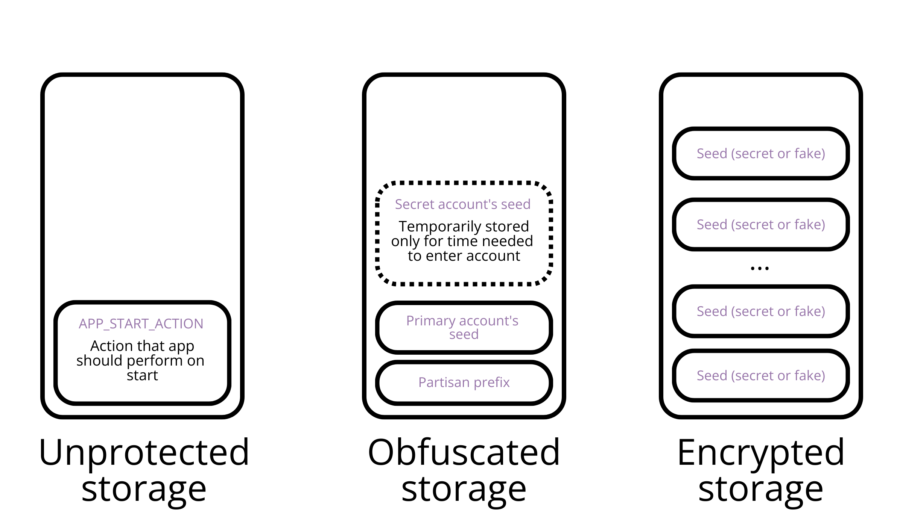
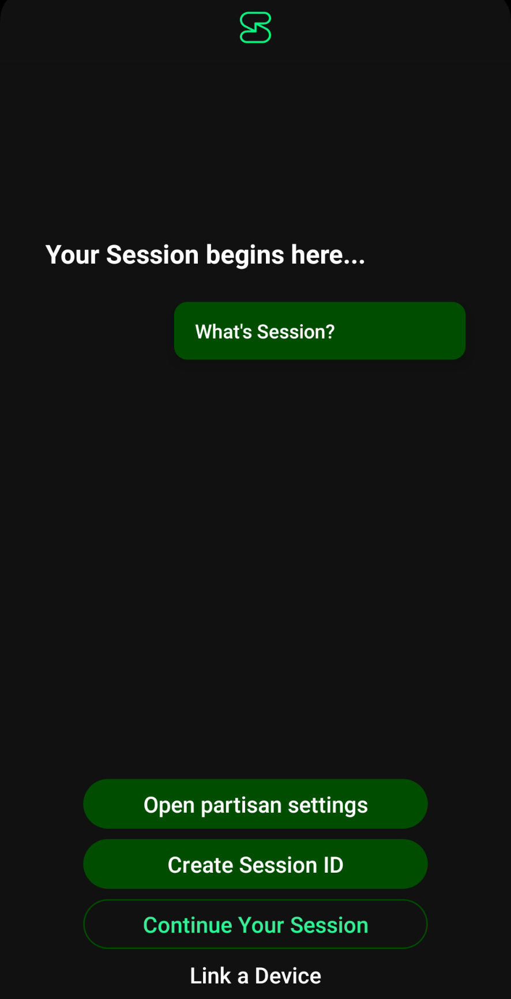
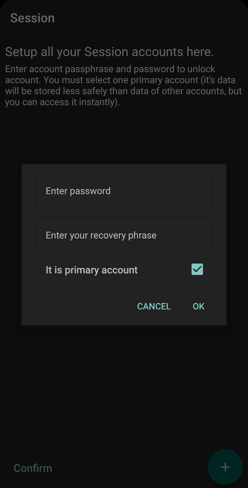
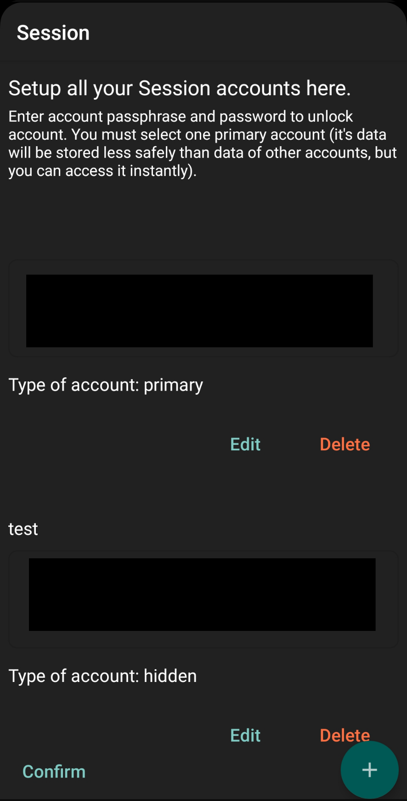
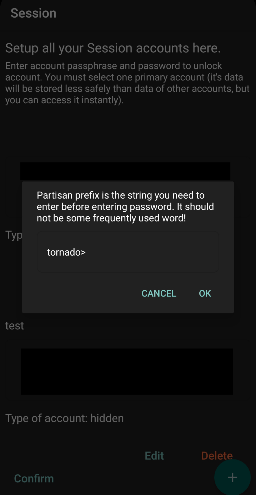
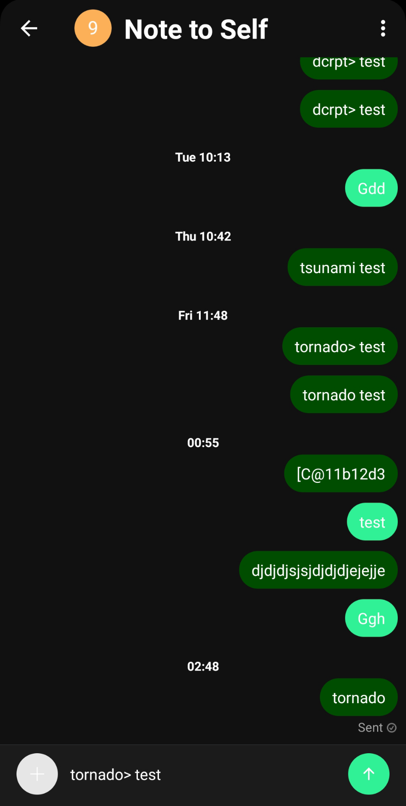
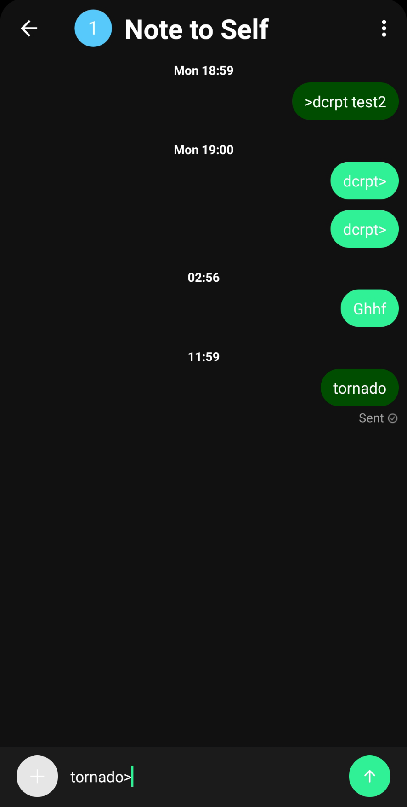

# PSession
**Приложение находится на этапе разработки, на данный момент его возможности недостаточно изучены и оно не рекомендуется для использования, если от его защищённости зависит Ваша безопасность!**
**Важно: Хотя я увлекаюсь криптографией, делаю всё возможное, чтобы PSession был максимально защищённым, и стараюсь избегать rolling out my crypto насколько это возможно, я не являюсь специалистом в этой области и могу допускать ошибки. Если вы профессионал в области криптографии, то Ваше мнение, Ваши советы или Ваша помощь жизненно важны для проекта.**
## Проблема
На данный момент, по моему мнению, Session - один из лучших мессенджеров для конфиденциального и анонимного общения. Тем не менее, хотя он хорошо защищает пользователей от государственной слежки и утечки их данных, многими пользователями [подчёркивалось](https://github.com/oxen-io/session-android/issues/1305), что он не обеспечивает защиты переписки в случае, если устройство попадёт в руки противника, способного оказать давление на пользователя устройства и заставить его разблокировать мессенджер. Эта угроза - печальная реальность для миллиардов людей, проживающих в авторитарных и тоталитарных режимах или находящихся под жёстким контролем со стороны третьих лиц (в неблагополучных семьях, под оккупацией, в сектах и т.д.).
Хотя защита сообщений от могущественного противника, способного угрожать пользователю и обладающего контролем над устройством - крайне сложная задача, киберпартизаны Беларуси уже предложили решение этой проблемы. Они создали для Телеграма кастомный клиент "[Партизанский телеграм](https://github.com/wrwrabbit/Partisan-Telegram-Android/releases)", позволяющий создавать фейковые коды-пароли, при вводе которых удаляется скрываемая информация (аккаунты или сообщения), а противник видит ту информацию, которую пользователь готов ему показать. Однако телеграм по своему дизайну - крайне небезопасный мессенджер, хранящий сообщения на централизованном сервере, требующий номера телефона для регистрации, не использующий сквозное шифрование по умолчанию, уязвимый для [анализа метаданных](https://www.nytimes.com/2023/07/03/technology/russia-ukraine-surveillance-tech.html) и [мониторинга](https://www.wired.com/story/the-kremlin-has-entered-the-chat/) со стороны спецслужб.
## Предложенное решение
Я предлагаю создать для Session систему, внешне напоминающую "Партизанский телеграм" (хотя принцип её работы сильно отличается) - это и есть PSession. При этом в Session на данный момент на экране блокировки используется или отпечаток пальца, с которым ничего путного не сделаешь, или, если пользователь не использует отпечаток пальца для блокировки телефона, системный компонент Android (Intent(ACTION_CONFIRM_DEVICE_CREDENTIAL)), повторяющий настройки экрана блокировки Android. Поэтому данная модификация вдохновлена [беспарольным режимом](https://t.me/cpartisans_security/260) "Партизанского телеграма". В нём пароль нужно ввести в поле поиска по сообщениям, и после этого будут раскрыты скрытые сообщение/скрытые аккаунты. В моём приложении поле ввода находится в поле для отправки сообщений (пока что), а помимо пароля нужно будет ввести заданный пользователем префикс.
## Модели угроз, задачи и решения
### Слабый противник
**Свойства:**
* Способен анализировать лишь графический интерфейс приложения
* Его временные ресурсы ограничены
* Может угрожать пользователю и принуждать его выполнять нужные ему действия с приложением.

**Задача**
* После завершения настроек приложение должно быть неотличимо от обычного Session, какие бы действия не осуществлялись с его графическим интерфейсом. Таким образом, получится избежать ненужного внимания и изучения со стороны более могущественного противника.

**Решения**
* После настройки приложения кнопка для открытия особых настроек удаляется.
* Для того, чтобы осуществлять с приложением какие-либо действия, не предусмотренные в оригинальном Session, нужно будет ввести заданный пользователем префикс.
* В остальном приложение не изменяет интерфейс Session и не создаёт в нём дополнительных багов.

### Могущественный противник
**Свойства:**
* Обладает полным контролем над устройством (рут-доступ) и серьёзными техническими знаниями и возможностями.
* Обладает большими временными и материальными ресурсами
* Может угрожать пользователю и принуждать его выполнять нужные ему действия с приложением или сообщать любые сведения, которые ему захочется получить.

**Задача**
* **Скрыть то, что на устройстве установлен не оригинальный Session, технически немозможно!**
* Пользователь должен иметь возможность настроить приложение таким образом, чтобы оставить по меньшей мере один аккаунт Session или хотя бы часть сообщений нераскрытыми.

**Решения**
* В приложении хранятся секретные фразы от разных аккаунтов пользователя. Для шифрования в приложении используется библиотека [Armadillo](https://github.com/patrickfav/armadillo/tree/main). Она написана на Java и её код мне понятен, её автор долгое время занимается криптографией, в ней осуществляется обфускация данных, она предоставляет широкие возможности для конфигурации. Под капотом используется AES GCM. В качестве функции формирования ключа по умолчанию используется bcrypt, но я заменил её на Argon2id ([обёртка от Signal](https://github.com/signalapp/Argon2)), чтобы следовать [рекомендациям OWASP](https://cheatsheetseries.owasp.org/cheatsheets/Password_Storage_Cheat_Sheet.html).
* Для ввода секретных данных клавиатура переводится в режим инкогнито.
* В приложении есть три вида хранилищ, основанных на SharedPreferences: незащищённое, обфусцированное и зашифрованное. В незащищённом хранилище хранятся данные, бесполезные для злоумышленника. В обфусцированном хранилище в зашифрованном виде без использования пользовательского пароля постоянно хранятся несколько более чувствительные данные, которые пользователь готов раскрыть могущественному противнику и существование которых невозможно скрыть от него (поэтому он всё равно может заставить выдать их под давлением), или там кратковременно хранятся секретные данные. При полном доступе к устройству и большом желании эти данные можно достать, но это не создаст дополнительных проблем для пользователя. В зашифрованном хранилище находятся секретные данные, надёжно зашифрованные с помощью его паролей.
* Пользователь выбирает один основной аккаунт, который он готов показать злоумышленнику и в который он сможет быстро переходить без пароля, остальные аккаунты считаются секретными. Кодовая фраза основного аккаунта заносится в обфусцированное хранилище и может быть получена без пароля. Также в обфусцированном хранилище сохраняется пользовательский префикс. Создаётся 10 (на данный момент) зашифрованных хранилищ. Случайно выбираются хранилища, в которых будут сохранены зашифрованные парольные фразы от секретных аккаунтов пользователя. В остальные хранилища будут сохранены зашифрованные фейковые данные. Поддельные секретные фразы генерируются с помощью встроенной функии Session. Поддельные данные шифруются с помощью случайно сгенерированного ключа. Сама программа не запоминает, где находятся настоящие данные, а где - фальшивки. При вводе пароля приложение пытается расшифровать каждое защищённое хранилище и, если какую-то парольную фразу удалось успешно расшифровать, то она временно вносится в обфусцированное хранилище, используется для входа в приложение и удаляется из хранилища. Это делается для того, чтобы сделать количество скрытых аккаунтов неопределённым и сделать цель противника менее понятной для него самого, что может позволить пользователю раскрыть под давлением лишь часть своих скрытых аккаунтов, правдоподобно отрицая наличие остальных.
* Схема хранения данных в приложении приведена ниже:

## Инструкция по использованию
1. Рекомендуется удалить оригинальный Session
2. Вы можете установить приложение из [релизов](https://github.com/dissidents0ft/partisan-session-android/releases).
3. Вы можете работать с Session, как обычно (но рекомендуется настроить PSession как можно раньше). При этом на стартовом экране приложения будет располагаться кнопка для перехода к партизанским настройкам.

4. Вы можете добавить новый аккаунт, введя его парольную фразу и пароль для разблокировки аккаунта. Число аккаунтов на данный момент не должно быть больше 10. Пароль должен быть сильным, но запоминаемым, на данный момент это никак не проверяется со стороны приложения. Вы должны отметить один из аккаунтов, как основной (для него, кстати, пароль не обязателен). Это аккаунт, который вы готовы показать противнику. Он не должен быть пустым!

5. Вы можете редактировать или удалять записи в списке

 6. Убедитесь, что всё введено правильно - на данном этапе развития приложения Вы никогда больше не сможете отредактировать эти настройки! Нажмите кнопку "Подтвердить". Введите свой префикс. Таблица, в которой временно хранились данные об аккаунтах и паролях, будет удалена (возможно, после этого приложению стоит стирать RAM, но пока это не реализовано). После этого будут сгенерированы поддельные записи и все записи будут зашифрованы.

7. Вы автоматически войдёте в основной аккаунт.

8. Выйдите из приложения и убейте его. Это нужно из-за какого-то пока непонятного бага.

9. Войдите снова. Откройте любой диалог (лучше диалог с самим собой) и введите в поле для ввода соообщений строку "ваш_префикс ваш_пароль". Отправьте сообщение. Оно, конечно, никуда не отправится, а будет обработано, и приложение попытается расшифровать все записи в зашифрованных хранилищах. Если расшифрование прошло успешно, то все данные текущего аккаунта удаляются, очищается кэш, приложение перезагружается, расшифрованная парольная фраза используется для автоматического входа в Ваш секретный аккаунт.

10. Вы можете войти в любой другой скрытый аккаунт, повторив шаги 8-9, или быстро войти в основной аккаунт, введя в поле для ввода сообщений просто префикс без пароля.

    
## Предстоящая работа
### Изменения, которые будут внесены в ближайшем будущем
На данный момент готова лишь быстрая и грязная реализация базового функионала. Есть ещё много вещей, над которыми следует поработать:
* Я перенесу поле ввода в поле поиска, чтобы уменьшить риск случайной отправки сообщения с Вашим префиксом и паролем
* Будет добавлена возможность указывать кастомные ограничения по памяти для алгоритма формирования ключа Argon2. Таким образом, для получения правильного ключа нужно будет знать не только пароль, но и ограничения по памяти, использовавшиеся при его генерации. Это будет напоминать использование PIM в Veracrypt.
* Будет добавлена возможность выбирать количество зашифрованных хранилищ. Повышать его, наверное, не стоит, но можно понизить, чтобы алгоритм работал быстрее.
* Будут добавлены аккаунты-разрушители. При добавлении записи можно будет пометить аккаунт как разрушитель. Если при расшифровывании выяснится, что эта запись - разрушитель, то все данные в зашифрованных хранилищах будут перезаписаны случайными данными.
* Будет добавлена возможность редактировать партизанские настройки после изначальной настройки.
* Будет добавлена возможность одноразового входа. Если выбрать эту опцию при входе, то если приложение пробудет в бэкграунде дольше заданного времени или если оно будет убито, то данные скрытого аккаунта будут стёрты и будет осуществлён вход в основной аккаунт.
* Будет добавлено стирание оперативной памяти после завершения настроек или входа в Session, как у [Molly](https://github.com/mollyim/mollyim-android).
* Будет улучшен GUI, добавлены валидаторы ввода, подсказки, диалоги. Приложение должно стать интуитивно понятным.
* Будет улучшено качество кода.
* Будет добавлено больше тестов.
* Будет добавлена возможность автоматически прокликать выбор типа уведомлений.

### Изменения, которые я постараюсь внести когда-нибудь
* Добавление полноценного мультиаккаунта в Session. На данный момент при вводе пароля пользователя выкидывает из текущего аккаунта и перебрасывает в другой, что выглядит не так красиво и удобно, как добавление нового аккаунта в мультиаккаунт. Впрочем, может быть разработчики сами это добавят.
* Добавление возможности прятать сообщения.
* На данный момент параметры Argon2 подобраны таким образом, чтобы соблюдать баланс между безопасностью и скоростью работы на испытанных мной устройствах (они строже [рекомендованных OWASP](https://cheatsheetseries.owasp.org/cheatsheets/Password_Storage_Cheat_Sheet.html#argon2id)). Тем не менее, на устройствах разной мощности можно выбирать разные настройки алгоритма. Я бы хотел сделать что-то вроде системы в KeePassXC, которая позволяет пользователю самому выбирать, сколько времени должен выполняться алгоритм формирования ключа, и подбирает параметры Argon2, основываясь на выборе пользователся.
* Возможность проверки обновлений приложения.
### Изменения, для внесения которых мне точно нужна помощь
* Портирование PSession на другие платформы, особенно на Linux.
* Перевод приложения на большее количество языков.
## Ключевые допущения
* Приложение во многом полагается на надёжность шифрования в бибилотеке Armadillo.
* Предполагается, что записи, зашифрованные с помощью случайно зашифрованного ключа, не удастся отличить от аналогичных по формату записей, зашифрованных с помощью ключа, полученного через Argon2.
* Предполагается, что пароли не остаются в памяти дольше необходимого.
  На данный момент верность этих допущений до конца не изучена.
  ##Известные баги
* Почему-то сразу после входа в новый аккаунт перейти в другой аккаунт не получится - перед этим надо убить приложение.
## От чего PSession точно не может защитить?
* От шпионских программ, которые могут перехватить пароль, вводимый вами в приложение.
* От подглядывания или разбалтывания пароля.
* От самодеанонимизации. Если Алиса отправит Бобу по Session фотографию своего паспорта, а Боб сообщит об этом куда следует, то Алисе будет очень сложно правдоподобно отрицать, что у неё есть аккаунт, с которого она переписывалась с Бобом. Впрочем, добавление функции скрытия сообщений может помочь Алисе сохранить хотя бы часть данных в тайне.
* В целом, чем больше у противника предварительной информации о Вас, чем выше его уверенность в достоверности этой информации и чем лучше противник понимает, что именно он хочет у Вас найти, тем меньше вероятность того, что PSession поможет Вам запутать его и не выдать то, что ему нужно.
* Кроме того, чем меньше у вас скрытых аккаунтов и чем менее правдободобно они выглядят, тем хуже. Со стороны могущественного противника, знающего, что вы используете PSession, будет разумным предположить наличие у вас хотя бы одного скрытого аккаунта. Причём крайне желательно, чтобы все эти аккаунты были не пустыми, содержали информацию, кажущуюся стоящей защиты, но не ту, за которую противник может вас покарать. Правдопободобность Вашей системы аккаунтов во многом зависит от Вас и Вашей модели угрозы.
## Как Вы можете помочь проекту?
* Вы можете написать мне в Session и дать совет или помочь с разработкой напрямую: 05c247ccec506ac294be3c7abd7959f3a92c304764d167fc9f82f79206ade1324d
* Вы можете создать обсуждение в GitHub.
* Вы можете задонатить в monero по адресу: 83xS78VwUptjftG3tH6rfrFuz4kgnCoU1cSAa3XCtWwya6kT7VgsqgJ3vYJUPGyAPQdo8bJqSQ9kFMbeiV5K2DCbPzTPin8
# License
Copyright 2011 Whisper Systems
Copyright 2013-2017 Open Whisper Systems
Copyright 2019-2021 The Oxen Project
Licensed under the GPLv3: http://www.gnu.org/licenses/gpl-3.0.html
